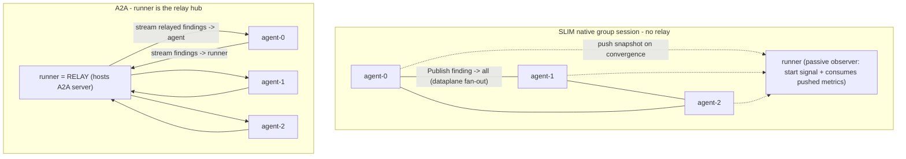

## SLIM native sessions vs A2A streaming relay

Goal: in-place rewrite of both transports in `benchmarks/slim-vs-a2a` to prove the thesis: native SLIM group sessions give true many-to-many with no relay; A2A requires a relay hub (the runner) even with real streaming; at N agents under a deadline, SLIM converges faster. The shared scenario/consensus/metrics/report core is reused; only the two transports and metric labels change.

### Target topologies

### 1. SLIM side -> native group sessions (no relay)

Delete the slimrpc relay path and rebuild on native sessions (APIs confirmed present in `slim-bindings-go v1.4.0`: `CreateSessionAndWaitAsync` + `SessionTypeGroup`, `InviteAndWaitAsync`, `ListenForSessionAsync`, `PublishAndWaitAsync`, `PublishToAndWaitAsync`, `GetMessageAsync`, `ParticipantsList`). Pattern reference: `/Users/smagyari/dev/slim/data-plane/bindings/go/examples/group/main.go`.

- Remove `[slim/internal/relay/hub.go](benchmarks/slim-vs-a2a/slim/internal/relay/hub.go)`, `[slim/internal/slimrpc/slimrpc.go](benchmarks/slim-vs-a2a/slim/internal/slimrpc/slimrpc.go)`, and the unused `[slim/internal/client/client.go](benchmarks/slim-vs-a2a/slim/internal/client/client.go)`.
- Extend `[slim/internal/protocol/protocol.go](benchmarks/slim-vs-a2a/slim/internal/protocol/protocol.go)` with a single JSON envelope sent over the session:
  - `Envelope{ Kind string; Finding *consensus.Finding; Snapshot *consensus.AgentSnapshot; AgentIndex int }` with `Kind` in `{"finding","start","snapshot"}`. No request/reply kinds — snapshots are pushed, not polled.
- Rewrite `[slim/internal/agent/runtime.go](benchmarks/slim-vs-a2a/slim/internal/agent/runtime.go)` (member):
  - Setup: create app `agntcy/bench-v2/agent-N`, connect, subscribe, then `ListenForSessionAsync(timeout)` to join the moderator's group session; keep `*slim.Session`.
  - Single receive loop on `session.GetMessageAsync`: dispatch by `Kind`:
    - `finding` -> `applyFinding` (skip own `AgentIndex`, `RecordPropagation`).
    - `start` -> save the message's `Context` (identifies the runner) for targeted snapshot pushes, then launch `runLoop` (unchanged Think/emit logic).
  - `publishFinding` -> `session.PublishAndWaitAsync(envelope{Kind:"finding"})` (broadcast to all peers; no relay).
  - Push metrics immediately (no polling): the agent emits a `snapshot` envelope via `PublishToAndWaitAsync(savedRunnerCtx, snapshot)` the instant it reaches local consensus, and again on any later metric change (throttled) and at run end, so the runner always has the latest. Targeting the runner keeps snapshots off the peer broadcast path.
- Rewrite `[slim/cmd/agent/main.go](benchmarks/slim-vs-a2a/slim/cmd/agent/main.go)`: drop `ServerNewWithConnection`/`Register`; just setup runtime, join session, block on the receive loop. Keep `SLIM_AGENT_READY` print. Flags unchanged plus optional `--channel` (default `agntcy/bench-v2/consensus`).
- Rewrite `[slim/cmd/runner/main.go](benchmarks/slim-vs-a2a/slim/cmd/runner/main.go)` (passive observer / moderator):
  - `startAgents` (unchanged spawn), then create the group session as moderator and `InviteAndWaitAsync` every agent name; small settle.
  - Broadcast a single `start` (defines t0); after that the runner does NOT poll. It runs one receive loop on `GetMessageAsync`, keeping a `map[agentIndex]AgentSnapshot` of the latest pushed snapshot per agent. It ignores `finding` broadcasts it incidentally receives (it never forwards them — agents already got them directly, so there is no relay).
  - Global-consensus detection is event-driven: after each pushed snapshot, run `consensus.GlobalConsensus` over the N latest snapshots; on success record wall time and finish. A 2-min deadline timer bounds the loop for the failure case.
  - `aggregateResult`: same fields, computed from the collected pushed snapshots; set `StreamRPCCount = FindingsEmitted` (one native multicast per finding), `CoordFanoutMS = 0`, `UnicastRPCCount = 0` to highlight "no relay".
  - Note on observation: the runner sees a copy of broadcast findings only because it is a group member, not because it relays them; agent-to-agent delivery happens via the SLIM dataplane fan-out independent of the runner.

### 2. A2A side -> runner as relay with real streaming

Make the runner the relay hub; remove the `agent-0` coordinator/fanout logic. Both legs are client-initiated A2A server-streams (`SendStreamingMessage`/executor `iter.Seq2[a2a.Event,error]`, present in `a2a-go v2.3.0`).

- `[a2a/internal/protocol/protocol.go](benchmarks/slim-vs-a2a/a2a/internal/protocol/protocol.go)`: add stream-init ops `OpStreamFindings` (runner subscribes to an agent's outbound findings) and `OpStreamRelay` (agent subscribes to runner's relayed findings); keep unary `OpStart`/`OpSnapshot`; drop `OpFinding`/`OpFanout`.
- Rewrite `[a2a/internal/agent/runtime.go](benchmarks/slim-vs-a2a/a2a/internal/agent/runtime.go)`:
  - Remove `isCoordinator`, `fanout`, per-peer clients. Agent dials only the runner relay (card URL passed in).
  - Hosts an A2A server: streaming `OpStreamFindings` executor drains an internal `findingsCh` and yields each as an `a2a.Event` until ctx done; unary `OpStart` (start `runLoop`) and `OpSnapshot` (return `AgentSnapshot`).
  - On start, agent (as client) opens `SendStreamingMessage(OpStreamRelay)` to the runner and applies every relayed finding (`applyFinding`, skip self, `RecordPropagation`).
  - `runLoop` pushes produced findings onto `findingsCh` (the publish leg) instead of unary send.
- Rewrite `[a2a/cmd/agent/main.go](benchmarks/slim-vs-a2a/a2a/cmd/agent/main.go)`: executor routes streaming vs unary ops; add `--relay-card-url` (runner's card) flag.
- Rewrite `[a2a/cmd/runner/main.go](benchmarks/slim-vs-a2a/a2a/cmd/runner/main.go)` + `[a2a/internal/client/client.go](benchmarks/slim-vs-a2a/a2a/internal/client/client.go)` (relay):
  - Runner hosts its own A2A server + card (new `--relay-grpc-port`/`--relay-card-port`, default e.g. 9690/10690) implementing streaming `OpStreamRelay`: registers each subscribing agent's outbound channel.
  - Runner (as client) subscribes via `SendStreamingMessage(OpStreamFindings)` to every agent; on each received finding, push into all agents' relay channels (skip none; agents skip self), incrementing `StreamRPCCount` and measuring `CoordFanoutMS`.
  - Pass the runner relay card URL to each spawned agent. Keep unary `OpStart`/`OpSnapshot` to drive/poll agents and `GlobalConsensus`.
  - `aggregateResult`: real `StreamRPCCount` (relayed events) and measured `CoordFanoutMS`; `UnicastRPCCount` = control RPCs only.

### 3. Labels, report, Taskfile

- Update impl tags in `[internal/benchlog/benchlog.go](benchmarks/slim-vs-a2a/internal/benchlog/benchlog.go)`: `ImplA2A = "a2a-relay-stream"`, `ImplSLIM = "slim-group-session"`; update the matching strings in `[tools/report/main.go](benchmarks/slim-vs-a2a/tools/report/main.go)` `groupByScenario`/labels.
- `[internal/metrics/metrics.go](benchmarks/slim-vs-a2a/internal/metrics/metrics.go)` struct/columns unchanged (semantics adjusted per above).
- `[Taskfile.yml](benchmarks/slim-vs-a2a/Taskfile.yml)`: `build` targets and slimctl dataplane block unchanged; SLIM runner now needs no extra ports; A2A runner gains relay-port flags (defaulted, so `compare:*` need minimal/no change). Add a one-line note to `[plans/README.md](benchmarks/slim-vs-a2a/plans/README.md)` that SLIM is relay-free and A2A relays via the runner.

### 4. Validate

- `task build`; `task compare:ci:smoke` (5 agents/20ms) to confirm both stacks converge and `reports/index.html` renders with the new tags.
- Run a sweep point at higher agent counts (e.g. 20 and 50 via existing `plans/sweeps/*`) to capture the `consensus_wall_ms` delta favoring SLIM, with both stacks under the same 2-min deadline.

### Risks / notes

- A2A long-lived streaming executor must yield events over time from a channel; if `a2a-go`'s task/streaming lifecycle fights a never-ending stream, fall back to: receive leg stays real streaming (agents subscribe to runner), publish leg becomes unary `SendMessage(OpFinding)` to the runner. Thesis (relay required) holds either way.
- SLIM session self-delivery: keep the existing self-skip by `AgentIndex` guard.
- Push-based snapshots: agents send their metric the instant they converge (no poll wait), so consensus is detected as soon as the last agent's snapshot arrives. The agent's converged snapshot already contains complete findings/propagation stats (it converged by receiving them); a throttled follow-up push plus an end-of-run push cover any late `findingsApplied` drift. Keep MLS off by default.
- Targeted snapshot push relies on the saved `start` message `Context` to address the runner; if reusing a stored context misbehaves, fall back to broadcasting `snapshot` envelopes (peers ignore non-self snapshots).
- Two CGO/native rewrites: build offline after `deps:slim-bindings-setup`; no new external deps.