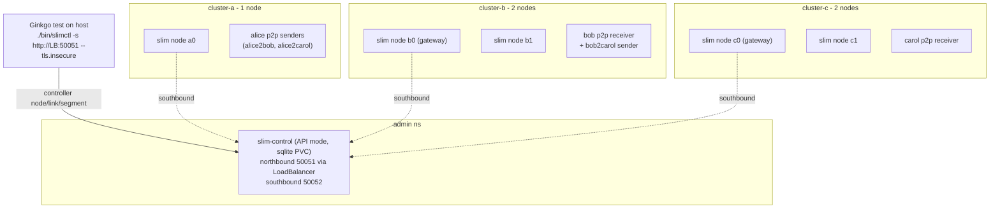

## Topology test refactor: clusters-only, slimctl-driven, p2p sessions

### Target topology and flow

Deploy responsibilities: the controller and the three clusters are deployed by Taskfile tasks (as today). The test deploys the client pods (alice/bob/carol), drives topology via `slimctl`, and performs restarts.

### 1. Config + Go model refactor

- Rename `[config/peer-to-peer.yaml](integrations/agntcy-slim/topology/config/peer-to-peer.yaml)` to `config/clusters.yaml`; drop the entire `clients:` block; set clusters:
  - `cluster-a`: `replicaCount: 1`
  - `cluster-b`: `replicaCount: 2`
  - `cluster-c`: `replicaCount: 2`
- In `[tests/config/topology_parser.go](integrations/agntcy-slim/topology/tests/config/topology_parser.go)`: remove `Client` struct, `Topology.Clients`, `GetClient`, `ListClients`. Keep `Server`/`Clusters`.
- `[tests/config/main/generate_configs.go](integrations/agntcy-slim/topology/tests/config/main/generate_configs.go)` already only iterates clusters; no functional change (drop stale client comments).
- Update `[Taskfile.yml](integrations/agntcy-slim/topology/Taskfile.yml)` `TOPOLOGY_CONFIG` default to `config/clusters.yaml`; update `[TopologyTest.md](integrations/agntcy-slim/topology/TopologyTest.md)` wording (clusters-only, slimctl-driven).

### 2. Controller: API mode + persistence + LoadBalancer

Edit `[config/controller-values.yaml](integrations/agntcy-slim/topology/config/controller-values.yaml)`:
- Switch to API mode by replacing the `topology.links` block with `topology: {}` (chart default is API mode).
- DB persistence is already the chart default (`config.database: {type: sqlite, path: /db/controlplane.db}` + `persistence.enabled: true`); set them explicitly here for clarity.
- Expose northbound to the host: set `service.type: LoadBalancer` (the chart's single Service publishes north `50051`/south `50052`; see `charts/slim-control-plane/templates/service.yaml`).
- Keep southbound insecure; nodes keep using the in-cluster southbound DNS (`SLIM_CONTROLLER_ENDPOINT`).

### 3. slimctl install + northbound endpoint discovery

- Add a `deps:slimctl-download` task to `[Taskfile.yml](integrations/agntcy-slim/topology/Taskfile.yml)` modeled on `[agent-consensus-test/Taskfile.yml](integrations/agntcy-slim/agent-consensus-test/Taskfile.yml)` (lines 29-56), installing to `./bin/slimctl`. Pin a tag whose slimctl supports `controller segment/link add` and `node list` (the local `crates/slimctl/src/commands/controller.rs` confirms these subcommands; use a `slimctl-v1.5.x`-era tag matching `SLIM_CONTROLLER_IMAGE_TAG=2.0.0-alpha.2`).
- The test discovers the northbound endpoint by reading the `slim-control` Service in `admin` (via clientset `status.loadBalancer.ingress[0].ip|hostname`) and builds `http://<lb>:50051`.
- The test shells out (os/exec) to `./bin/slimctl -s http://<lb>:50051 --tls.insecure controller ...`, parsing table output. Confirmed commands: `controller node list`, `controller group list`, `controller segment add <name>`, `controller link add <a> <b> [-s <segment>]`, `controller link list [-a]`, `controller link remove ...`.

### 4. p2p clients (existing Python image)

Use `slim-bindings-p2p` from the existing `[examples/Dockerfile](integrations/agntcy-slim/topology/examples/Dockerfile)` image (no Rust `channel` build, no new image). Keep the simple `ClientConfig` JSON ConfigMap approach the current test already uses (endpoint + `tls.insecure`), one per client, pointing at `agntcy-<cluster>-slim.<cluster>.svc.cluster.local:46357`.

p2p roles (1:1), matching the flags already used in `peer-to-peer.yaml` (`slim-bindings-p2p --local <name> [--remote <name>] [--message <m> --iterations <n>] --shared-secret <s>`). Receivers run passively (no `--remote`/`--message`) and log `received: <msg>`; senders target one `--remote`, send `--iterations` messages, and log `Sent message <msg> - i/N`. Deploy:
- `alice2bob` (cluster-a): sender `--local org/ns/alice --remote org/ns/bob --message hi-from-alice` -> proves a<->b.
- `alice2carol` (cluster-a): sender `--local org/ns/alice --remote org/ns/carol --message hi-from-alice` -> proves a<->c.
- `bob` (cluster-b): passive receiver `--local org/ns/bob`.
- `carol` (cluster-c): passive receiver `--local org/ns/carol`.
- `bob2carol` (cluster-b): sender `--local org/ns/bobx --remote org/ns/carol --message hi-from-bob` -> tests b<->c isolation.

All share the same `--shared-secret`. Distinct `--message` strings let a receiver's log reveal the source (`received: hi-from-alice` vs `received: hi-from-bob`). Continuous sending = large `--iterations`; verify during implementation that p2p paces sends (or add a delay/loop) so the sender keeps running long enough to observe restart recovery.

### 5. Extend k8shelper

Add to `[integrations/testutils/k8shelper](integrations/testutils/k8shelper)`:
- `ListPodsByLabel(selector string) ([]corev1.Pod, error)` and `DeletePodByName(name string)` — to find/kill the gateway node pod.
- `RestartDeployment(name string)` / rollout-restart helper for the controller and cluster deployments (or delete-pod + rely on Deployment recreate).
- Log absence/timeout helper: `WaitForStringWithTimeout(searchString, timeout) (found bool)` (wrap `LogWatcher`), plus an `AssertLogAbsent` pattern (watch for a window, assert not found via `GetLogs`). Needed for "bob cannot reach carol".

### 6. Rewrite the Ginkgo suite (When/Then)

Replace the single "Create SLIM client Pods" spec in `[tests/topology_test.go](integrations/agntcy-slim/topology/tests/topology_test.go)` with an `Ordered` suite; each scenario a `ginkgo.When(...)` with `It("then ...")` so the report reads as when/then. Clients are created inside scenarios and cleaned up via `DeferCleanup`.

- When control-plane and clusters are deployed / Then all clusters and nodes are joined: assert `slimctl controller node list` shows all 5 nodes `Connected` and `group list` shows cluster-a/b/c.
- When cluster-a is linked to cluster-b and cluster-a to cluster-c in separate segments (via `slimctl controller segment add seg-b; link add cluster-a cluster-b -s seg-b; segment add seg-c; link add cluster-a cluster-c -s seg-c`) and the p2p clients are deployed / Then alice reaches bob and carol (bob's receiver log shows `received: hi-from-alice`; carol's receiver log shows `received: hi-from-alice`) but bob does not reach carol (carol's log never shows `received: hi-from-bob` within the window; use `AssertLogAbsent`). Assert links via `slimctl controller link list`.
- When the topology is modified so cluster-b and cluster-c are linked (`link add cluster-b cluster-c -s <seg>`) / Then alice still reaches both and bob can now reach carol (carol's log now shows `received: hi-from-bob`); assert the new link with `slimctl controller link list`.
- When the gateway node in cluster-b (or cluster-c per link direction, identified via `slimctl controller link list` source/dest node) is stopped and restarted / Then the link is restored (`link list` APPLIED) and bob still reaches carol (the continuous bob2carol sender keeps sending and carol resumes logging `received: hi-from-bob` after recovery).
- When the control-plane is restarted (rollout restart; sqlite PVC preserves topology) / Then links remain intact (`link list` still APPLIED after CP comes back).

### Risks / assumptions to confirm during implementation
- LoadBalancer requires the kind cluster to provide external IPs (cloud-provider-kind/metallb); otherwise fall back to NodePort or `kubectl port-forward`. User asked for LoadBalancer, so plan for it and verify env support.
- slimctl release tag must include the API-mode `link/segment add` subcommands; verify the exact published tag exists.
- The "bob cannot reach carol" expectation assumes segment isolation blocks b<->c. With pure p2p (no shared group/relay through alice) bob2carol has no CP-installed route across segments, so it should fail cleanly; if the test shows bob reaching carol that is a real finding — revisit segment/relay settings. Keep this assertion configurable.
- Continuous sending uses `slim-bindings-p2p --iterations <large>`; verify the p2p example has no lower cap and that request/reply pacing (or an inter-send delay) keeps it running long enough to observe restart recovery. If p2p bursts without pacing, add a small delay or loop the sender.
