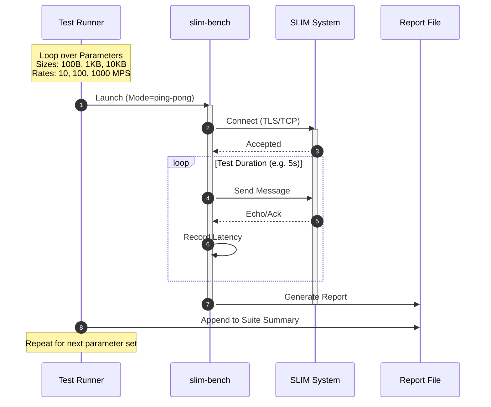

# SLIM Benchmark Tool & Suite

`slim-bench` is a high-performance load generator and benchmarking tool designed for the SLIM (Secure Light-weight Instant Messaging) protocol. It is capable of measuring latency (Min, P50, P99, Max) and throughput across various payload sizes and message rates.

The suite is automated via `run_suite.sh`, which executes a sweep of benchmarks and consolidates the results into a Markdown report.

## Components

1.  **slim-bench**: The core Go binary. It connects to the SLIM Data Plane, generates traffic (ping-pong or flood), and calculates statistics.
2.  **run_suite.sh**: The automation script. It builds the tool and runs a matrix of tests (sizes vs. rates).

## Usage

### Prerequisites
- Go 1.22+

### Running the Suite

To run the full benchmark suite:

```bash
./run_suite.sh
```

This will:
1. Build `slim-bench` from `main.go`.
2. Execute benchmarks for 100B, 1KB, and 10KB payloads at 10, 100, and 1000 MPS.
3. Generate a consolidated report at `reports/suite_summary.md`.

### Manual Usage

You can also run `slim-bench` individually:

```bash
go run main.go --mode=ping-pong --size=1024 --rate=100 --duration=10s --output=my_report.md
```

## Workflow Diagram

The following diagram illustrates the execution flow when running the full suite:



## Benchmark Logic

1.  **Connection**: The tool establishes a connection to the target system (currently simulated).
2.  **Traffic Generation**:
    *   **Ping-Pong Mode**: Sends a message and waits for a response before sending the next (synchronous). Ideal for latency measurement.
    *   **Flood Mode (Planned)**: Sends messages as fast as possible (asynchronous). Ideal for throughput measurement.
3.  **Measurement**:
    *   Accesses system clock with high precision.
    *   Tracks Round-Trip Time (RTT) for every message.
4.  **Analysis**:
    *   Sorts collected latencies to find percentiles.
    *   Formats output into a human-readable Markdown table.
