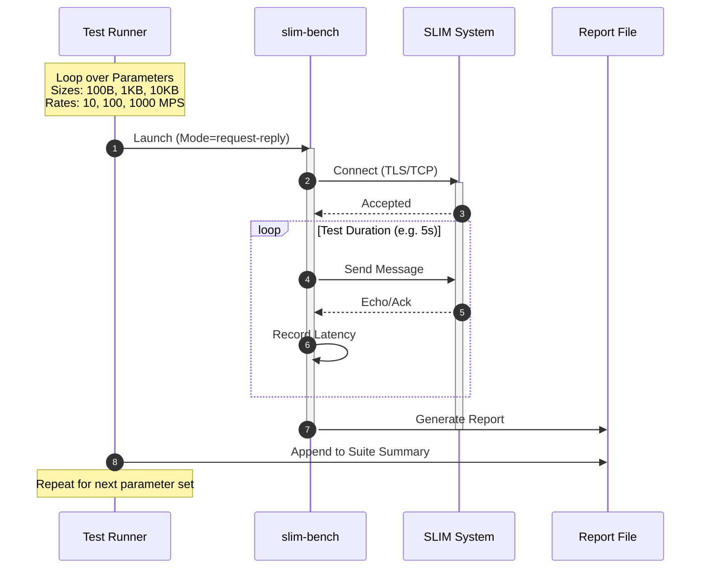

# SLIM Benchmark Tool & Suite

`slim-bench` is a load generator and benchmarking tool for the SLIM (Secure Light-weight Instant Messaging) protocol. It measures latency (Min, P50, P99, Max), throughput, and runtime errors across payload sizes, client counts, and input rates.

The suite is automated by a Ginkgo benchmark spec in `benchmarks/agntcy-slim/tests/benchmark_suite_test.go`. The `run_suite.sh` script is only a thin launcher for that spec.

## Components

1.  **slim-bench**: The core Go binary. It connects to the SLIM Data Plane, generates traffic, and calculates statistics.
2.  **benchmark_suite_test.go**: The Ginkgo-based suite runner. It starts a local SLIM node, provisions the responder topology needed by each workload, runs the benchmark matrix, and writes markdown reports.
3.  **run_suite.sh**: Thin wrapper that launches the labeled Ginkgo suite with `go test`.

## Usage

### Prerequisites
- Go 1.22+
- `task` available in the shell
- `slimctl` available in `PATH`, or install it with `task benchmarks:slim:deps:slimctl-download`

### Running the Suite

The reproducible entrypoint is the Task target from the repository root:

```bash
task benchmarks:slim:benchmark:suite
```

That target always:
1. Runs from the correct benchmark directory.
2. Kills leftover local `slimctl`, `echo-client`, and `rate-client` processes from previous runs.
3. Applies a stable default benchmark matrix unless you override variables.

You can override the suite inputs directly on the task invocation:

```bash
task benchmarks:slim:benchmark:suite \
    BENCH_MODES='fire-and-forget write' \
    BENCH_CLIENTS='10' \
    BENCH_SIZES='128 1024' \
    BENCH_DURATION='2s' \
    BENCH_REPEATS='3'
```

For the repeated adaptive knee test used in the recent capacity study, use:

```bash
task benchmarks:slim:benchmark:capacity:fire-and-forget-16kb
```

That task runs the fixed reproducible profile for:
- mode: `fire-and-forget`
- clients: `1`
- payload: `16kB`
- duration: `2s`
- adaptive sweep start/max: `128000` -> `176000`
- sweep growth factor: `1.125`
- sweep repeats per step: `3`

Additional reproducible workload-specific triggers:

```bash
task benchmarks:slim:benchmark:request-reply
task benchmarks:slim:benchmark:fire-and-forget
task benchmarks:slim:benchmark:write
task benchmarks:slim:benchmark:capacity:request-reply-16kb
task benchmarks:slim:benchmark:capacity:write-16kb
```

The old task names and old mode spellings have been removed. Use only `request-reply`, `fire-and-forget`, and `write`.

CI-oriented bounded triggers:

```bash
task benchmarks:slim:benchmark:ci:suite-smoke
task benchmarks:slim:benchmark:ci:capacity
```

The CI targets are intentionally smaller than the developer-facing defaults:
- `benchmark:ci:suite-smoke` runs a `1s` single-client smoke matrix across `request-reply`, `fire-and-forget`, and `write`
- `benchmark:ci:capacity` runs bounded `5s` adaptive sweeps for `fire-and-forget`, `request-reply`, and `write` using `1` client at `16kB`
- both targets are intended to be called directly from CI without shell preamble

The GitHub Actions workflow uploads a single Markdown artifact per job so the result is directly readable:
- smoke job artifact: `ci-smoke-report.md`
- capacity job artifact: `ci-capacity-report.md`

For CI runners that do not already provide `slimctl`, install it first with:

```bash
task benchmarks:slim:deps:slimctl-download SLIMCTL_PATH="$HOME/.local/bin/slimctl"
export PATH="$HOME/.local/bin:$PATH"
```

To run the full benchmark suite:

```bash
task benchmarks:slim:benchmark:suite

# equivalent low-level launcher
./run_suite.sh
```

By default this will:
1. Build the benchmark helpers through the Go test suite.
2. Start a local SLIM node via `slimctl`.
3. Execute `request-reply`, `fire-and-forget`, and `write` benchmarks from the Ginkgo suite.
4. Generate per-run reports under `reports/raw/`, plus `reports/results.tsv`, `reports/suite_summary.md`, and `reports/technical_report.md`.

The suite is configurable through environment variables:

```bash
MODES='request-reply fire-and-forget write'
CLIENTS='1 10 50'
SIZES='16 128 1024 10240'
REQUEST_RATES='1000'
PUB_RATES='1000'
WRITE_RATES='2000'
DURATION='5s'
bash ./run_suite.sh
```

You can also enable an exploratory adaptive capacity sweep that increases the configured rate until sink throughput plateaus:

```bash
CAPACITY_SWEEP=1 \
CAPACITY_SWEEP_MODES='fire-and-forget' \
CAPACITY_SWEEP_CLIENTS='1' \
CAPACITY_SWEEP_SIZES='16384' \
CAPACITY_SWEEP_START_RATE='1000' \
CAPACITY_SWEEP_GROWTH_FACTOR='2.0' \
CAPACITY_SWEEP_PLATEAU_THRESHOLD='0.05' \
CAPACITY_SWEEP_PLATEAU_STEPS='2' \
CAPACITY_SWEEP_MAX_STEPS='8' \
bash ./run_suite.sh
```

Notes:
- `request-reply` is the round-trip mode and should use paced rates.
- `fire-and-forget` uses a sink responder and defaults to a safe automatic rate profile when `PUB_RATES` is unset.
- `write` measures sender-to-node write rate with no responder process; it uses `WRITE_RATES` when set, otherwise it falls back to `PUB_RATES`.
- Set `PUB_RATES='0'` only when you want an explicit unpaced stress run.
- Live `sub` benchmarking is not implemented yet and is intentionally rejected by the binary.
- When `CAPACITY_SWEEP=1`, the suite writes an additional `reports/capacity_sweep.md` report.
- The sweep stops when the mode-specific effective throughput fails to improve by the configured threshold for the configured number of consecutive steps, or when `CAPACITY_SWEEP_MAX_STEPS` / `CAPACITY_SWEEP_MAX_RATE` is reached.

### Manual Usage

You can also run `slim-bench` individually:

```bash
go run . -mode=request-reply -size=1024 -rate=100 -duration=10s -server=http://127.0.0.1:46357 -dest=agntcy/demo/echo -output=my_report.md
```

## Workflow Diagram

The following diagram illustrates the execution flow when running the full suite:



## Benchmark Logic

1.  **Connection**: The tool establishes a live connection to a SLIM node.
2.  **Traffic Generation**:
    *   **Request-Reply Mode**: Sends a message and waits for a response before sending the next. Ideal for RTT measurement.
    *   **Fire-And-Forget Mode**: Sends one-way traffic to a sink responder. Ideal for end-to-end throughput measurement through the node.
    *   **Write Mode**: Sends messages without any responder. Ideal for measuring how quickly the sender can write accepted messages into the node.
3.  **Measurement**:
    *   Accesses system clock with high precision.
    *   Tracks operation latency for every message.
4.  **Analysis**:
    *   Sorts collected latencies to find percentiles.
    *   Records runtime errors alongside throughput and latency.
    *   Formats output into a human-readable Markdown report.
