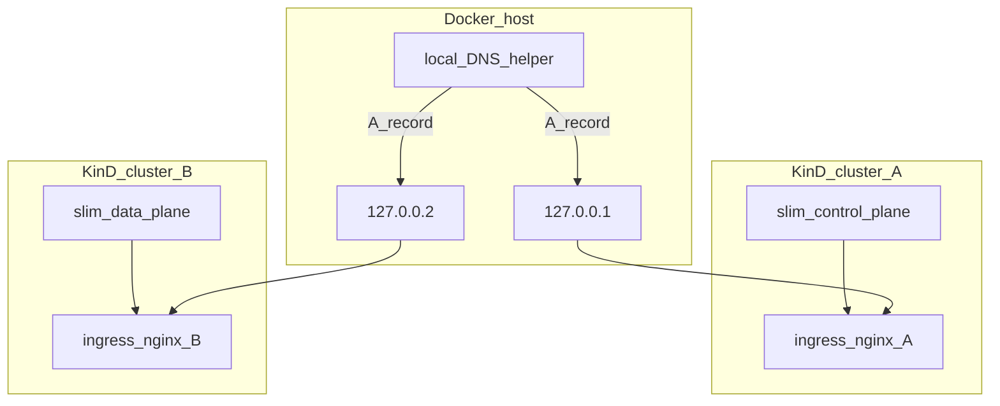

# Multi-cluster slim test infrastructure (KinD + ingress + DNS)

**Overview:** Multi-KinD slim testbed with cluster A hosting the control plane, cluster B (and others) reachable from A via ingress hostnames, optional reverse path B→A modeled with split DNS (host-local DNS helper, e.g. CoreDNS in Docker) and distinct loopback aliases so each cluster can own port 80/443 on different IPs. Extend slim config generation where a single controller endpoint is insufficient.

## Goals

- **At least two Kubernetes clusters** (KinD matches existing [`integrations/Taskfile.yml`](integrations/Taskfile.yml) patterns).
- **Cluster A** runs the **slim control plane** (e.g. `slim-controller` chart in [`integrations/agntcy-slim/Taskfile.yml`](integrations/agntcy-slim/Taskfile.yml)).
- **Cross-cluster traffic** uses **Ingress** (HTTP/gRPC as supported by ingress-nginx and slim) to published services—not cluster-internal `*.svc.cluster.local` across clusters.
- **Reachability**: **A can always reach B**. **B may or may not reach A** (asymmetric scenarios): implement by optional ingress/DNS entries and different generated slim endpoints (B uses public ingress to A when enabled; otherwise only A-initiated or one-way paths).

## Existing repo hooks

- Topology YAML already supports **multiple clusters** under `topology.clusters` (see [`integrations/agntcy-slim/config/peer-to-peer.yaml`](integrations/agntcy-slim/config/peer-to-peer.yaml) with `cluster-a` / `cluster-b`).
- [`integrations/agntcy-slim/tests/config/main/generate_configs.go`](integrations/agntcy-slim/tests/config/main/generate_configs.go) generates one server config per cluster but passes the **same** `SLIM_CONTROLLER_ENDPOINT` to **every** cluster. For “controller only in A,” you need **per-cluster** controller client endpoints (in-cluster DNS on A; **ingress URL** on B when B must talk to the controller).
- Topology tests today assume a **single** Kubernetes client ([`integrations/agntcy-slim/tests/topology_test.go`](integrations/agntcy-slim/tests/topology_test.go)); multi-cluster execution will need **two contexts** (merged kubeconfig or explicit `KUBECONFIG`) and deploy steps repeated per cluster.

## KinD: two clusters, two ingresses (avoid port collision)

Two KinD clusters cannot both bind **host TCP 80/443** unless you multiplex.

**Practical pattern (simple + automatable):**

1. Give each cluster its own **KinD `extraPortMappings`**, mapping container 80/443 to **different host addresses** on the loopback range.
2. On **macOS**, add **loopback aliases**, e.g. `127.0.0.1` for cluster A and `127.0.0.2` for cluster B (`sudo ifconfig lo0 alias 127.0.0.2 up`). Linux supports similar `127.0.0.0/8` addressing.
3. Point cluster A’s ingress NodePort/LB publishing at **127.0.0.1:80/443** and cluster B’s at **127.0.0.2:80/443** (same container ports, different host bind targets).

Then **DNS A records** can distinguish clusters without SRV records:

- `control.cluster-a.dev.test` → `127.0.0.1`
- `slim.cluster-b.dev.test` → `127.0.0.2`

Clients use normal `https://host` / gRPC authority; ports stay 80/443 per IP.

**Alternative** (fewer aliases): one shared host port with a **host-level reverse proxy** routing by `Host` to the correct KinD loadbalancer port; more moving parts, better if you must not use multiple 127.x addresses.

## Ingress surface

- **Cluster A**: Ingress objects for anything **B** (or the host) must call—at minimum the **northbound** slim controller API if data plane in B registers or receives control traffic that way. Exact paths depend on slim’s supported ingress annotations (gRPC mode, TLS).
- **Cluster B**: Ingress for slim dataplane / MCP / northbound as required for **A→B** traffic.
- **Asymmetric B→A**: Omit ingress for A, or omit DNS records / use NetworkPolicy to block; tests assert one-way behavior.

## DNS (ties to prior plan)

- A **small host-local DNS server** (CoreDNS or similar) remains a good default: static or generated A records per logical hostname → `127.0.0.1` / `127.0.0.2` (wildcards per subdomain if you prefer `*.cluster-b.dev.test`).
- **macOS**: `/etc/resolver/dev.test` → `nameserver 127.0.0.1` (DNS helper container published on host loopback).
- Automation reads KinD mapping table (known by convention) rather than scraping NodePorts if you standardize port maps.

## Slim configuration and topology automation

| Concern | Action |
|--------|--------|
| Controller only in A | Deploy `slim-controller` only on context A; do not deploy controller chart on B. |
| Data plane in B talks to controller | Generated slim config for B must set `controller.clients[0].endpoint` to **ingress hostname** (and TLS appropriate to ingress), not `slim-control…svc.cluster.local`. |
| Data plane in A talks to controller | Keep **in-cluster** `slim-control.ns.svc.cluster.local:50051` (or whatever chart exposes). |
| Global env var gap | Extend [`GenerateClusterConfigs`](integrations/agntcy-slim/tests/config/main/generate_configs.go) (and topology schema if needed) with **per-cluster** `slimControllerEndpoint` (or a map `clusters.<name>.controllerEndpoint`) instead of one `SLIM_CONTROLLER_ENDPOINT`. |

## Test harness

- **Deploy order**: KinD A + B → ingress each → DNS render → SPIRE/slim charts per topology doc if still required → generated per-cluster configs → `helm upgrade` with `--kube-context` per cluster.
- **Ginkgo / topology tests**: Either split into two `Describe` blocks with different clientsets, or parameterize context name from topology metadata (requires schema extension: `clusters.<name>.kubeContext`).

## Summary

| Layer | Choice |
|-------|--------|
| Clusters | 2+ KinD clusters, separate kubeconfig contexts |
| Collision-free ingress | Loopback aliases + per-cluster `extraPortMappings` to distinct 127.x addresses |
| DNS | Host-local DNS helper with A records per logical hostname → 127.0.0.1 / 127.0.0.2 |
| Asymmetry | Optional ingress/DNS/routes for B→A; slim config reflects allowed directions |
| Repo code gap | Per-cluster controller endpoint in generator; multi-context deploy/test driver |
