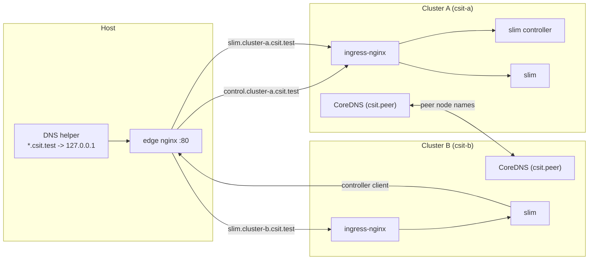

# Two KinD clusters + CoreDNS peer names (slim)

**Clusters:** KinD **csit-a** / **csit-b** on the Docker `kind` network; configs publish ingress on **127.0.0.1** (A **10080**/10443, B **9080**/9443). **`task up`** applies the in-cluster **`csit.peer`** CoreDNS stub (`node-a.csit.peer` / `node-b.csit.peer`).

**What this does not do:** pods still cannot resolve the **other** cluster’s `*.svc.cluster.local` without extra plumbing—use **`csit.peer`** for node IPs and expose services accordingly (**NodePort**, **hostPort**, etc.).

- **`task up`** — clusters + **`csit.peer`** patch only.
- **`task up:with-ingress-apps`** — also ingress-nginx, host edge nginx, Docker **local DNS helper** ([`optional/with-ingress/dns`](optional/with-ingress/dns)), Helm, Ingress YAML.

CI runs **`up:with-ingress-apps`** / **`down:with-ingress-apps`**. Run all tasks from this directory.

## GitHub Actions

Workflow: [`../.github/workflows/kind-slim-multicluster.yml`](../.github/workflows/kind-slim-multicluster.yml)

| Trigger | Behavior |
|---------|----------|
| `push` to `main` | Installs tooling via [`.github/actions/setup-k8s`](../.github/actions/setup-k8s), then `task prereq` → `task up:with-ingress-apps` → checks → `task down:with-ingress-apps`. Path filters: `kind-slim-multi-host/**`, this workflow, and `setup-k8s` action. |
| `pull_request` | Same as push, with the same path filters. |
| `workflow_dispatch` | Same as push/pull_request (no extra inputs). |

All triggers run the same latest full infra path (`task up:with-ingress-apps`) and the same cleanup path (`task down:with-ingress-apps`).

### Test the workflow locally

**Option A (recommended):** run the same steps CI uses. From the repo root, with Docker running and `kind`, `kubectl`, `jq`, and `task` installed (any recent versions):

```bash
cd kind-slim-multi-host
task prereq
task up:with-ingress-apps
kubectl --context kind-csit-a get nodes
kubectl --context kind-csit-b get nodes
kubectl --context kind-csit-a -n ingress-nginx get pods
kubectl --context kind-csit-b -n ingress-nginx get pods
kubectl --context kind-csit-a get configmap coredns -n kube-system -o jsonpath='{.data.Corefile}' | grep -q "BEGIN csit-peer"
dig @127.0.0.1 -p 8053 +short control.cluster-a.csit.test
dig +tcp @127.0.0.1 -p 8053 +short slim.cluster-b.csit.test
kubectl --context kind-csit-a run dns-verify -n default --rm --attach --restart=Never \
  --image=docker.io/library/busybox:1.36 --command -- nslookup node-b.csit.peer
task down:with-ingress-apps
```

**Option B ([act](https://github.com/nektos/act)):** run Actions in Docker from the **repository root** (the directory that contains `kind-slim-multi-host/` and `.github/`). KinD needs nested Docker and often a **privileged** runner image; this is brittle on some hosts (especially Apple Silicon). Example dry run:

```bash
act -n -W .github/workflows/kind-slim-multicluster.yml workflow_dispatch
```

No workflow inputs are required for this job anymore. Full job parity is usually easier with **Option A** on your laptop.

## Prerequisites

- [Docker](https://docs.docker.com/get-docker/)
- [kind](https://kind.sigs.k8s.io/)
- [kubectl](https://kubernetes.io/docs/tasks/)
- [jq](https://jqlang.org/)
- [Task](https://taskfile.dev/) (recommended)

Helm is required for **`task up:with-ingress-apps`** / **`task apps:install`**; not for bare **`task up`**.

## Quick start

From `kind-slim-multi-host/`:

```bash
task prereq
task up
```

This creates clusters **csit-a** and **csit-b** (contexts `kind-csit-a`, `kind-csit-b`), writes `coredns/.gen/peers.env`, patches CoreDNS on both clusters, and restarts the CoreDNS Deployment when it exists.

### Verify

From cluster A:

```bash
kubectl --context kind-csit-a run -n default --rm -it --restart=Never dns-test --image=busybox:1.36 -- nslookup node-b.csit.peer
```

You should see the Docker IP of `csit-b-control-plane`.

### Tear down

```bash
task teardown
```

Deletes both Kind clusters. Generated files under `coredns/.gen/` can be removed manually; they are gitignored.

### Local: slim + controller exposed through Ingress

Use this when you want **ingress-nginx** gRPC Ingress objects, **edge nginx** on the host (`127.0.0.1:80`), a local **DNS helper** for `*.csit.test`, and **Helm** installs for slim + control plane.

#### Architecture (simplified)



- **DNS helper:** resolves local `*.csit.test` names to loopback for host access.
- **edge nginx:** host entrypoint that routes by hostname to cluster A or B ingress.
- **ingress-nginx:** receives routed traffic and forwards to slim/controller services.
- **CoreDNS (`csit.peer`):** enables cross-cluster peer node-name resolution.
- **slim + controller:** controller runs on A; slim runs on both clusters, with B reaching controller through host DNS/edge/ingress.

1. **macOS split-DNS (recommended):** create `/etc/resolver/csit.test` (requires admin) so `*.csit.test` hits the local DNS helper. Use the **same port** as `CSIT_LOCAL_DNS_HOST_PORT` (default **8053** — avoids **53** and macOS **5353**/mDNS):

   ```
   nameserver 127.0.0.1
   port 8053
   ```

   If **8053** is taken, pick another free port: `task optional:with-ingress:dns:up CSIT_LOCAL_DNS_HOST_PORT=15353` and set `port 15353` in the resolver file.

   The DNS helper container now uses CoreDNS (still started via `task optional:with-ingress:dns:up`) because it is more reliable on Docker Desktop for both UDP and TCP DNS queries. It still serves `*.csit.test` as `127.0.0.1` and publishes the configured host port.
2. From `kind-slim-multi-host/`, if clusters already exist from an older layout, run `task teardown` (and stop any prior edge/dns: `task optional:with-ingress:edge:down`, `task optional:with-ingress:dns:down`).
3. Run the combined Task:

```bash
task up:with-ingress-apps
```

This runs `task up` then `task optional:with-ingress:full` (ingress-nginx on both clusters → edge → local DNS helper → Helm + Ingress manifests).

4. **Cluster B → cluster A controller:** default Helm values use `control.cluster-a.csit.test:80` (through edge). That works well from the **host** with split-DNS. **Slim pods on B** may not resolve `csit.test` the same way; on **Docker Desktop** you can reinstall slim on B with the optional overlay [`helm/values/slim-cluster-b.docker-desktop.yaml`](helm/values/slim-cluster-b.docker-desktop.yaml) (see comments in that file).

**Tear down everything (Helm, compose, Kind):**

```bash
task down:with-ingress-apps
```

## Task reference

| Task | Purpose |
|------|---------|
| `task up` | `prereq` → create both clusters → `coredns:discover` → `coredns:apply:all` |
| `task up:with-ingress-apps` | `task up` then optional ingress + edge + local DNS helper + Helm + Ingress YAML |
| `task down:with-ingress-apps` | `apps:uninstall` → edge/dns compose down → `teardown` |
| `task coredns:discover` | Refresh `coredns/.gen/peers.env` from Docker |
| `task coredns:apply:a` / `coredns:apply:b` | Patch CoreDNS on one context |
| `task coredns:apply:all` | Both clusters |
| `task teardown` | `kind:delete:all` |

Environment overrides: `CLUSTER_A`, `CLUSTER_B`, `KIND_DOCKER_NETWORK` (default `kind`) — see `scripts/discover-peer-ips.sh`. Optional stack: **`CSIT_LOCAL_DNS_HOST_PORT`** (default `8053`) for DNS-helper compose + macOS resolver `port`.

## Helm values (optional)

Charts install with **`task up:with-ingress-apps`** or, after **`task up`**, `task prereq:apps` → **`task apps:install`** once ingress (and host DNS, if using `*.csit.test`) is set up.

| File | Role |
|------|------|
| [`helm/values/controller.yaml`](helm/values/controller.yaml) | slim-control-plane on A |
| [`helm/values/slim-cluster-a.yaml`](helm/values/slim-cluster-a.yaml) | Slim on A |
| [`helm/values/slim-cluster-b.yaml`](helm/values/slim-cluster-b.yaml) | Slim on B; controller client → `control.cluster-a.csit.test:80` (edge + local DNS helper / split-DNS) |
| [`helm/values/slim-cluster-b.docker-desktop.yaml`](helm/values/slim-cluster-b.docker-desktop.yaml) | Optional overlay for pod-on-B → A via `host.docker.internal:10080` |

## Optional: Ingress, edge, local DNS helper

See [`optional/with-ingress/README.md`](optional/with-ingress/README.md). Default [`kind/cluster-*.yaml`](kind/cluster-a.yaml) already includes **ingress-ready** labels and **host port maps**; older copies live under `optional/with-ingress/kind/*.portmap.example.yaml` for reference.

After `task up`, you can still run only part of the stack, for example:

```bash
task optional:with-ingress:full
```

(Order: ingress-nginx on both clusters → edge → DNS helper → Helm + Ingress manifests.) Prefer **`task up:with-ingress-apps`** for a single command from a clean machine.

## Limitations

- **Stub zone only:** `csit.peer` maps to **Kind node container IPs**, not remote Service DNS.
- **Reachability:** pod → peer node IP must use a port that routing allows (often NodePort or a published port on that node).
- **Kind/CoreDNS versions:** the apply script expects a `deployment/coredns` in `kube-system`; if your Kind version differs, adjust the rollout target to match your cluster.
