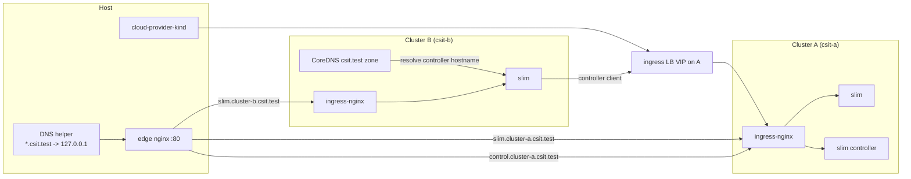

# Two KinD clusters + ingress LoadBalancer (slim)

**Clusters:** KinD **csit-a** / **csit-b** on the Docker `kind` network; configs publish ingress on **127.0.0.1** (A **10080**/10443, B **9080**/9443).

**Cross-cluster:** **`task up:with-ingress-apps`** starts [**cloud-provider-kind**](https://github.com/kubernetes-sigs/cloud-provider-kind), exposes cluster **A** **ingress-nginx** as a **LoadBalancer**, and patches CoreDNS on cluster **B** so **`control.cluster-a.csit.test`** resolves to that LoadBalancer IP (pods on **B** hit the same Ingress hostname as the slim/control-plane charts). See [`coredns/README.md`](coredns/README.md).

**What this does not do:** remote **`*.svc.cluster.local`** is not mirrored—only the explicit **`control.cluster-a.csit.test`** edge for the controller.

- **`task up`** — create both clusters only (no ingress / no CoreDNS cross-cluster patches).
- **`task up:with-ingress-apps`** — **`task up`** then **`optional:with-ingress:full`**: cloud-provider-kind → ingress-nginx → **LoadBalancer on A** → CoreDNS alias on **B** → edge nginx → local DNS helper → Helm ([`helm/values/`](helm/values/) + upstream slim charts).

CI runs **`up:with-ingress-apps`** / **`down:with-ingress-apps`**. Run all tasks from this directory.

## GitHub Actions

Workflow: [`../.github/workflows/kind-slim-multicluster.yml`](../.github/workflows/kind-slim-multicluster.yml)

| Trigger | Behavior |
|---------|----------|
| `push` to `main` | Installs `setup-k8s`, **Go**, Task; `task prereq` → `task up` → load images → `task optional:with-ingress:full` (same steps as **`up:with-ingress-apps`**) → checks → **`task down:with-ingress-apps`**. Path filters: `kind-slim-multi-host/**`, this workflow, `setup-k8s`. |
| `pull_request` | Same as push, with the same path filters. |
| `workflow_dispatch` | Same as push/pull_request (no extra inputs). |

All triggers run the same full infra path (`task up` + **`optional:with-ingress:full`**, equivalent to **`up:with-ingress-apps`**) and **`task down:with-ingress-apps`** for cleanup.

### Test the workflow locally

**Option A (recommended):** run the same steps CI uses. From the repo root, with Docker running and `kind`, `kubectl`, `jq`, and `task` installed (any recent versions):

```bash
cd kind-slim-multi-host
task prereq
task up:with-ingress-apps
kubectl --context kind-csit-a get nodes
kubectl --context kind-csit-b get nodes
kubectl --context kind-csit-a -n ingress-nginx get pods
kubectl --context kind-csit-b -n ingress-nginx get pods
kubectl --context kind-csit-a get svc -n ingress-nginx ingress-nginx-controller -o jsonpath='{.spec.type}' ; echo
kubectl --context kind-csit-b get configmap coredns -n kube-system -o jsonpath='{.data.Corefile}' | grep -q "BEGIN csit-cross-cluster"
source coredns/.gen/ingress-a.env && kubectl --context kind-csit-b run dns-verify-b -n default --rm --attach --restart=Never \
  --image=docker.io/library/busybox:1.36 --command -- sh -c "nslookup control.cluster-a.csit.test | grep -F '${INGRESS_A_LB_IP}'"
dig @127.0.0.1 -p 8053 +short control.cluster-a.csit.test
dig +tcp @127.0.0.1 -p 8053 +short slim.cluster-b.csit.test
task down:with-ingress-apps
```

**Option B ([act](https://github.com/nektos/act)):** run Actions in Docker from the **repository root** (the directory that contains `kind-slim-multi-host/` and `.github/`). KinD needs nested Docker and often a **privileged** runner image; this is brittle on some hosts (especially Apple Silicon). Example dry run:

```bash
act -n -W .github/workflows/kind-slim-multicluster.yml workflow_dispatch
```

No workflow inputs are required for this job anymore. Full job parity is usually easier with **Option A** on your laptop.

## Prerequisites

- [Docker](https://docs.docker.com/get-docker/)
- [kind](https://kind.sigs.k8s.io/)
- [kubectl](https://kubernetes.io/docs/tasks/)
- [jq](https://jqlang.org/)
- [Task](https://taskfile.dev/) (recommended)

Helm and **Go** are required for **`task up:with-ingress-apps`** / **`optional:with-ingress:full`** (cloud-provider-kind runs `go run`). Helm alone suffices for **`task apps:install`** after ingress is ready manually.

## Quick start

From `kind-slim-multi-host/`:

```bash
task prereq
task up
```

This creates clusters **csit-a** and **csit-b** (contexts `kind-csit-a`, `kind-csit-b`) only.

### Verify (full ingress stack)

After **`task up:with-ingress-apps`**, from cluster **B**:

```bash
source coredns/.gen/ingress-a.env
kubectl --context kind-csit-b run -n default --rm -it --restart=Never dns-test \
  --image=busybox:1.36 --command -- sh -c "nslookup control.cluster-a.csit.test | grep -F '${INGRESS_A_LB_IP}'"
```

### Tear down

```bash
task teardown
```

Deletes both Kind clusters. Generated files under `coredns/.gen/` (`ingress-a.env`, etc.) can be removed manually; they are gitignored.

### Local: slim + controller exposed through Ingress

Use this when you want **ingress-nginx** gRPC Ingress objects, **edge nginx** on the host (`127.0.0.1:80`), a local **DNS helper** for `*.csit.test`, and **Helm** installs for slim + control plane.

#### Architecture (simplified)



- **DNS helper:** resolves local `*.csit.test` names to loopback for **host** access.
- **edge nginx:** host entrypoint that routes by hostname to cluster A or B ingress port maps.
- **cloud-provider-kind:** assigns a **LoadBalancer IP** to ingress on A so **pods on B** can route to the same Ingress VIP (not loopback).
- **CoreDNS on B:** **`control.cluster-a.csit.test` → LoadBalancer IP** (`csit-cross-cluster` block).
- **slim + controller:** controller runs on A; slim on B uses that hostname through ingress on A.

1. **macOS split-DNS (recommended):** create `/etc/resolver/csit.test` (requires admin) so `*.csit.test` hits the local DNS helper. Use the **same port** as `CSIT_LOCAL_DNS_HOST_PORT` (default **8053** — avoids **53** and macOS **5353**/mDNS):

   ```
   nameserver 127.0.0.1
   port 8053
   ```

   If **8053** is taken, pick another free port: `task optional:with-ingress:dns:up CSIT_LOCAL_DNS_HOST_PORT=15353` and set `port 15353` in the resolver file.

   The DNS helper container now uses CoreDNS (still started via `task optional:with-ingress:dns:up`) because it is more reliable on Docker Desktop for both UDP and TCP DNS queries. It still serves `*.csit.test` as `127.0.0.1` and publishes the configured host port.
2. From `kind-slim-multi-host/`, if clusters already exist from an older layout, run `task teardown` (and stop any prior edge/dns: `task optional:with-ingress:edge:down`, `task optional:with-ingress:dns:down`).
3. Run the combined Task:

```bash
task up:with-ingress-apps
```

This runs `task up` then `task optional:with-ingress:full` (cloud-provider-kind → ingress → LoadBalancer on A → CoreDNS on B → edge → local DNS helper → Helm; Ingress rules come from [`helm/values/`](helm/values/) via slim/control-plane charts).

4. **Cluster B → cluster A controller:** slim values use **`http://control.cluster-a.csit.test`**; pods resolve it via **CoreDNS on B** to cluster **A** ingress **LoadBalancer IP**. On **Docker Desktop**, if the LB VIP is not reachable from pods, merge [`helm/values/slim-cluster-b.docker-desktop.yaml`](helm/values/slim-cluster-b.docker-desktop.yaml).

**Tear down everything (Helm, compose, Kind):**

```bash
task down:with-ingress-apps
```

## Task reference

| Task | Purpose |
|------|---------|
| `task up` | `prereq` → create both clusters |
| `task up:with-ingress-apps` | `task up` then optional stack (LoadBalancer + CoreDNS on B + edge + DNS helper + Helm) |
| `task down:with-ingress-apps` | `apps:uninstall` → edge/dns compose down → `teardown` |
| `task kind:cloud-provider-kind:up` | Start cloud-provider-kind (background); needed before **`optional:with-ingress:ingress:lb:a`** |
| `task optional:with-ingress:ingress:lb:a` | Patch cluster **A** ingress Service to **LoadBalancer** |
| `task ingress:a:wait-lb-ip` | Wait for LB IP → `coredns/.gen/ingress-a.env` |
| `task coredns:apply:cluster-b:ingress-alias` | Merge **`control.cluster-a.csit.test`** zone into CoreDNS on **B** |
| `task coredns:strip:legacy-peer` | Remove old **`csit.peer`** blocks after upgrading from older layouts |
| `task teardown` | `kind:delete:all` |

Environment overrides: `CLUSTER_A`, `CLUSTER_B`, **`CSIT_DNS_ZONE`** (default `csit.test`), **`INGRESS_SVC`** (default `ingress-nginx-controller`). Optional stack: **`CSIT_LOCAL_DNS_HOST_PORT`** (default `8053`). The DNS **`Corefile`** under `optional/with-ingress/dns/` is **generated** (gitignored); created by `task optional:with-ingress:dns:render` or before compose via `task optional:with-ingress:dns:up`.

## Helm values (optional)

Charts install with **`task up:with-ingress-apps`** or, after **`task up`**, `task prereq:apps` → **`task apps:install`** once ingress (and host DNS, if using `*.csit.test`) is set up.

| File | Role |
|------|------|
| [`helm/values/controller.yaml`](helm/values/controller.yaml) | slim-control-plane on A |
| [`helm/values/slim-cluster-a.yaml`](helm/values/slim-cluster-a.yaml) | Slim on A |
| [`helm/values/slim-cluster-b.yaml`](helm/values/slim-cluster-b.yaml) | Slim on B; controller client → **`http://control.cluster-a.csit.test`** (ingress LB + CoreDNS on B) |
| [`helm/values/slim-cluster-b.docker-desktop.yaml`](helm/values/slim-cluster-b.docker-desktop.yaml) | Optional fallback when LB VIP is not reachable from pods (`host.docker.internal:10080`) |

## Optional: Ingress, edge, local DNS helper

See [`optional/with-ingress/README.md`](optional/with-ingress/README.md). [`kind/cluster-*.yaml`](kind/cluster-a.yaml) defines **ingress-ready** labels and **host port maps** for the edge proxy.

After `task up`, you can still run only part of the stack, for example:

```bash
task optional:with-ingress:full
```

(Order: ingress-nginx on both clusters → edge → DNS helper → Helm.) Prefer **`task up:with-ingress-apps`** for a single command from a clean machine.

## Limitations

- **Explicit hostname only:** only **`control.cluster-a.csit.test`** is wired for controller ingress from **B**; remote **`*.svc.cluster.local`** is not mirrored.
- **Go + sudo (Darwin):** **`kind:cloud-provider-kind:up`** runs **`sudo -v`** first (blocking, so you can enter your password), then **`sudo go run …`** in the background and waits until the controller process exists. Logs: **`coredns/.gen/cloud-provider-kind.stderr`**.
- **Kind/CoreDNS:** merge scripts expect `deployment/coredns` in `kube-system`; adjust if your Kind layout differs.
